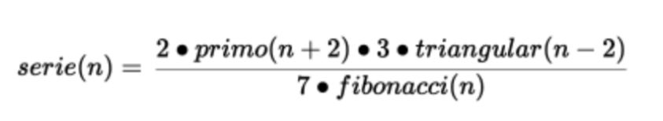

# Reto-Técnico-React

Desarrollado por: Ana Karen Morales Ramos

## Índice

* [1. Introducción](#1-introducción)
* [2. Objetivos generales](#2-objetivos-generales)
* [3. Criterios de aceptación](#3-criterios-de-aceptación)
* [4. Criterios de evaluación](#4-criterios-de-evaluación)
* [5. Entrega](#5-entrega)
* [6. Acerca de la aplicación](#6-acerca-de-la-aplicación)

## 1. Introducción

En el siguiente reto técnico desarrollé una aplicación que implementa una calculadora y en la cual sus componentes asociados fueron realizados con la tecnología de React y JavaScript. La serie numérica está definida por la siguiente fórmula:

## 2. Objetivos generales

1. Desarrollar una clase con un método que entregue el término n de la serie.
2. Desarrollar 3 componentes utilizando la tecnología de React, Angular o Vue.

## 3. Criterios de aceptación

Desarrollar lo siguiente:
 
1. Un componente visual que muestre un formulario para introducir el número n.

2. Un componente no-visual donde se calcule el término n de la serie.

3. Un componente visual que muestre el resultado del cálculo.

4. Deberan ser componentes distintos, integrados en una misma aplicación para evaluar el paso de información entre componentes.

5. Se puede utilizar JavaScript o TypeScript usando como runtime node.js o deno.js y un corredor de pruebas unitarias. 

## 4. Criterios de evaluación

1. Se evaluará la calidad del código en términos de presentación y lógica.

2. Se evaluará el cumplimiento de los requerimientos solicitados.

3. El entrevistador debe poder instalar las dependencias del proyecto y correr las pruebas unitarias.

## 5. Entrega

El entregable es un repositorio público conteniendo el proyecto completo (de npm o similar) en la plataforma de GitHub, GitLab, BitBucket o similares.

## 6. Acerca de la aplicación

Componentes
1. Formulario

El componente visual de formulario está implementado en el archivo userInterface.jsx. Este componente permite al usuario introducir el valor de n para calcular el término correspondiente de la serie.

2. Cálculo de "n"

El componente no-visual, ubicado en el archivo method.jsx, contiene la lógica para calcular el término n de la serie utilizando un componente de clase con un método desarrollado.

3. Resultado

El componente visual de resultado se encuentra en el archivo result.jsx. Este componente muestra un modal con el resultado del cálculo realizado.

## 6.1 Ejecución

Para ejecutar la aplicación, sigue estos pasos:

1. Asegúrate de tener <node.js/deno.js> instalado en tu sistema.

2. Instala las dependencias ejecutando **npm install**.

3. Ejecuta la aplicación con el comando **npm start**.

## 6.2 Pruebas unitarias

Para ejecutar las pruebas unitarias, utiliza el comando **npm test**.
Las pruebas están diseñadas para cubrir diez casos diferentes del método de cálculo, uno para cada número natural del 1 al 10.
Así mismo hay un caso de prueba para cada función realizada.

## 6.3 Despliegue

Antes de desplegar la aplicación, es necesario construir los archivos necesarios. Ejecuta el siguiente comando **npm run build**. 
En este caso la aplicación fue desplegada con vercel.

